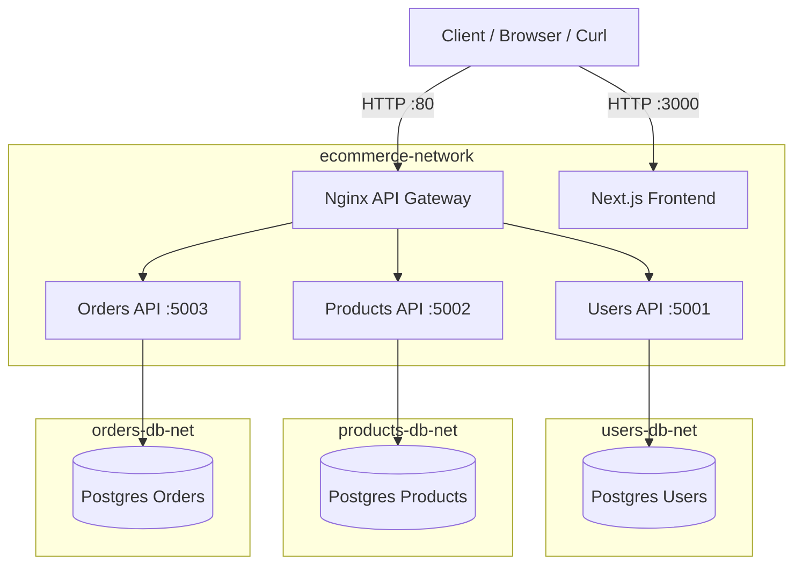

# Architecture

Plateforme e-commerce simple en microservices, orchestrée avec Docker Compose.

## Schéma (Mermaid)

## Réseaux

- `ecommerce-network` relie gateway, frontend et APIs.
- `users-db-net`, `products-db-net`, `orders-db-net` isolent chaque base.
