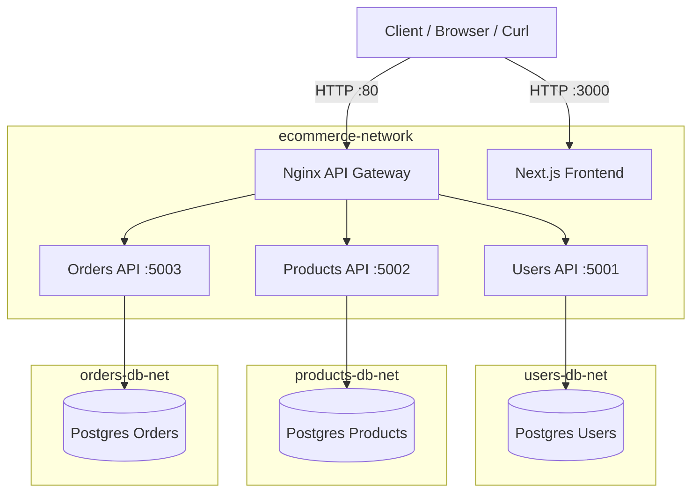

# Architecture

This project is a simple e-commerce platform using a microservices architecture with Docker Compose.

## Diagram (Mermaid)

## Networks

- `ecommerce-network` connects gateway, frontend, and APIs.
- `users-db-net`, `products-db-net`, `orders-db-net` are internal networks, isolating each database.